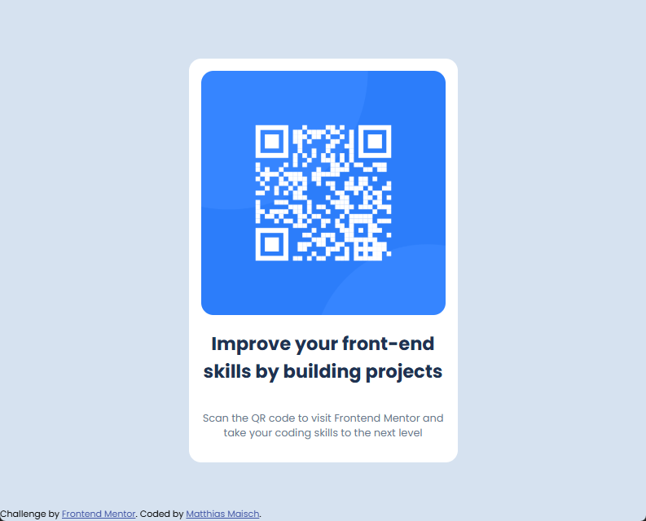

# Frontend Mentor - QR code component solution

This is a solution to the [QR code component challenge on Frontend Mentor](https://www.frontendmentor.io/challenges/qr-code-component-iux_sIO_H). Frontend Mentor challenges help you improve your coding skills by building realistic projects. 

## Table of contents

- [Overview](#overview)
  - [Screenshot](#screenshot)
  - [Links](#links)
- [My process](#my-process)
  - [Built with](#built-with)
  - [What I learned](#what-i-learned)
  - [Continued development](#continued-development)
  - [Useful resources](#useful-resources)
- [Author](#author)

## Overview

### Screenshot

### Links

- Solution URL: [github.com/solloc/qr-code-component-main](https://github.com/solloc/qr-code-component-main)
- Live Site URL: [solloc.github.io/qr-code-component-main](https://solloc.github.io/qr-code-component-main)

## My process

### Built with

- Semantic HTML5 markup
- CSS custom properties
- Flexbox

### What I learned

Using variables in CSS

### Continued development

Positioning of elements in a flex box or grid

### Useful resources

- [web.dev](https://web.dev/), especially the Learn CSS Path

## Author

- Website - [Matthias Maisch](https://www.novaimpact.com)
- X - [@solloc](https://x.com/sollloc)
